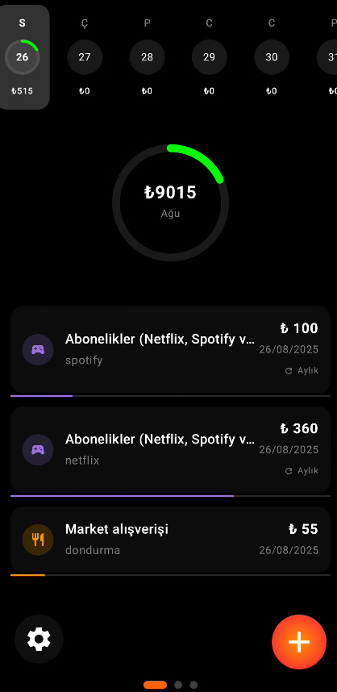

# 💰 Expense Tracker

A modern, feature-rich expense tracking application built with **Kotlin** and **Jetpack Compose** for Android. Track your daily and monthly expenses with beautiful progress visualizations, recurring expense management, and intuitive UI.

## ✨ Features

### 📊 Smart Progress Tracking
- **Daily & Monthly Progress Rings** - Visual progress indicators with green-yellow-red gradient
- **Real-time Limit Monitoring** - Get alerts when you exceed your spending limits
- **Category-based Analytics** - See your spending patterns by category

### 🔄 Recurring Expenses
- **Flexible Recurrence Types** - Daily, Weekdays, Weekly, and Monthly
- **Dual Management System** - Manage recurring expenses globally or edit individual occurrences
- **End Date Control** - Set custom end dates for recurring expenses
- **Smart Generation** - Automatically creates individual expense records for each occurrence

### 📅 Advanced Calendar Views
- **Weekly History View** - Track your spending patterns throughout the week
- **Monthly Calendar View** - Comprehensive monthly overview with progress indicators
- **Monday-Sunday Layout** - Consistent calendar layout starting from Monday
- **Interactive Date Selection** - Tap any date to view detailed expenses

### 🎨 Modern UI/UX
- **Material 3 Design** - Latest Material Design principles
- **Dark/Light Theme Support** - Automatic theme switching
- **Smooth Animations** - Fluid transitions and interactions
- **Responsive Layout** - Optimized for different screen sizes

### ⚙️ Customizable Settings
- **Multiple Currencies** - Support for various currency symbols
- **Custom Limits** - Set personalized daily and monthly spending limits
- **Theme Preferences** - Choose between dark and light themes

## 📱 Screenshots

<!-- Add your screenshots here -->
<div align="center">
  
  
  
  
  
  
</div>


## 🏗️ Architecture

### Tech Stack
- **Language**: Kotlin
- **UI Framework**: Jetpack Compose
- **Architecture**: MVVM (Model-View-ViewModel)
- **Database**: Room Database
- **State Management**: StateFlow & MutableStateFlow
- **Dependency Injection**: Manual DI (can be upgraded to Hilt)

### Project Structure
```
app/src/main/java/com/example/expensetrackerkotlin/
├── data/                    # Data layer
│   ├── Expense.kt          # Expense data model
│   ├── DailyData.kt        # Daily data model
│   └── database/           # Room database components
├── ui/                     # UI layer
│   ├── screens/            # Main screens
│   ├── components/         # Reusable UI components
│   └── theme/              # Theme and styling
├── viewmodel/              # ViewModels
└── repository/             # Data repository
```

## 🚀 Installation

### Prerequisites
- Android Studio Arctic Fox or later
- Android SDK 24+
- Kotlin 1.8+

### Setup
1. **Clone the repository**
   ```bash
   git clone https://github.com/yourusername/ExpenseTracker.git
   cd ExpenseTracker
   ```

2. **Open in Android Studio**
   - Open Android Studio
   - Select "Open an existing project"
   - Navigate to the cloned repository and select it

3. **Build and Run**
   - Connect an Android device or start an emulator
   - Click the "Run" button or press `Shift + F10`

## 📖 Usage

### Adding Expenses
1. Tap the **+** button to add a new expense
2. Fill in the expense details:
   - Amount and currency
   - Category (Food, Transport, Shopping, etc.)
   - Date and time
   - Optional description
3. For recurring expenses:
   - Select recurrence type (Daily, Weekdays, Weekly, Monthly)
   - Set an end date (optional)
4. Tap "Save" to add the expense

### Managing Recurring Expenses
1. Tap the **Edit** button (blue gradient) to open recurring expenses
2. View all your recurring expense groups
3. Edit or delete recurring expenses (affects all future occurrences)
4. Individual expenses can still be modified in the main list

### Viewing Progress
- **Daily Progress Ring**: Shows today's spending vs. daily limit
- **Monthly Progress Ring**: Shows monthly spending vs. monthly limit
- **Weekly History**: Swipe through the week to see daily totals
- **Monthly Calendar**: Tap the monthly ring to see the full calendar view

### Settings
1. Tap the **Settings** button (bottom-left)
2. Configure:
   - Default currency
   - Daily spending limit
   - Monthly spending limit
   - Theme preference (Dark/Light)

## 🎯 Key Features Explained

### Progress Ring System
The app uses a sophisticated progress ring system with:
- **Green-Yellow-Red Gradient**: Visual indication of spending progress
- **Limit Over Detection**: Red color when limits are exceeded
- **Smooth Animations**: Fluid progress updates
- **Consistent Theming**: Adapts to dark/light themes

### Recurring Expense Logic
- **Individual Records**: Each occurrence gets a unique ID
- **Shared Group ID**: Recurring expenses share a `recurrenceGroupId`
- **Flexible Management**: Edit globally or individually
- **Smart Generation**: Automatically creates future occurrences

### Calendar Integration
- **Monday-First Layout**: Consistent with international standards
- **Progress Indicators**: Each day shows spending progress
- **Interactive Selection**: Tap any date to view details
- **Month Navigation**: Easy month-to-month navigation

## 🤝 Contributing

We welcome contributions! Please feel free to submit a Pull Request. For major changes, please open an issue first to discuss what you would like to change.

### Development Setup
1. Fork the repository
2. Create a feature branch (`git checkout -b feature/AmazingFeature`)
3. Commit your changes (`git commit -m 'Add some AmazingFeature'`)
4. Push to the branch (`git push origin feature/AmazingFeature`)
5. Open a Pull Request

## 📄 License

This project is licensed under the MIT License - see the [LICENSE](LICENSE) file for details.

## 🙏 Acknowledgments

- **Jetpack Compose** for the modern UI framework
- **Material Design** for design guidelines
- **Room Database** for local data persistence
- **Android Community** for inspiration and support

## 📞 Support

If you have any questions or need help, please:
- Open an issue on GitHub
- Check the existing issues for solutions
- Contact the maintainers

---

**Made with ❤️ using Kotlin and Jetpack Compose**

